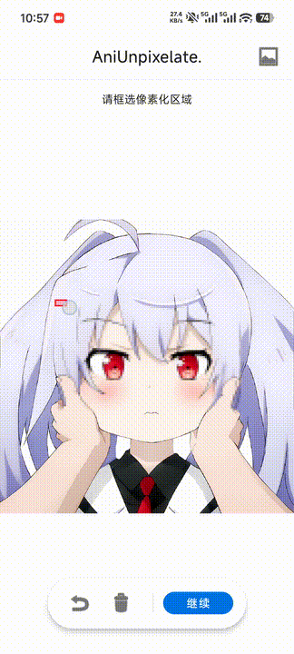

# AniRestore - Anime Image AI Restoration Tool

**English Version** | [中文版本](README.md)

**AniRestore (AniUnpixelate)** is an AI-powered restoration tool specifically designed for anime-style illustrations and CGI art. It leverages deep neural networks to intelligently repair and fill in pixelated or mosaic areas in images.

> [!IMPORTANT]
> **Technical Note**: The AI model used in this project is **NOT a generative model**. It does not "re-draw" or "imagine" new content from scratch. Instead, it utilizes deep convolutional algorithms to analyze the color distribution and structural patterns within pixelated blocks to **reconstruct/restore the underlying color information and original visual composition**.

## 🌟 Key Features

- **AI-Powered Unpixelating**: Uses pre-trained deep convolutional neural networks for texture synthesis in missing pixel areas.
- **Offline ONNX Inference**: Integrated with ONNX Runtime, all AI computations are performed locally on the device—no cloud uploads, ensuring maximum privacy.
- **Customizable Repair Area**: Allows users to manually select or brush over specific areas for precise local restoration.
- **Seamless Blending**: Employs Alpha blending technology to ensure naturally smooth transitions between AI-generated content and the original background.

## 🚀 Getting Started

1. **Import Image**: Click the "Import Anime Photo" button to select a local image.
2. **Select Area**: Drag or brush over the pixelated/mosaic area on the preview.
3. **Run Restoration**: Click "Unpixelate," and the AI will automatically process the image.
4. **Save Result**: Once restored, the image will be saved automatically to your gallery.

## 🛠️ Technology Stack

- **Platform**: Android
- **Language**: Java / Kotlin
- **AI Engine**: ONNX Runtime
- **Model Architecture**: Anime-specific restoration model (256x256 input) based on GAN or Residual Networks.

## ⚠️ Legal & Disclaimer

This project is intended for academic research on deep learning applications in image processing.

1. **Prohibited Use**: Any illegal or unauthorized usage is strictly forbidden. Users hold full responsibility for their actions.
2. **Scope of Application**: To prevent abuse, this demo is optimized **only for Anime/CGI style** images and is not suitable for photorealistic images.
3. **Privacy**: The application operates entirely offline and does not collect any user image data.

---